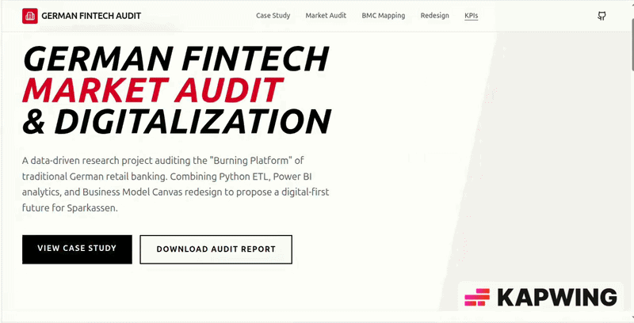

# German Fintech Market Audit & Digitalization

<p align="center">
   
</p>

## Why This Project Matters for DigiBIM
This project is a direct reflection of the skills and mindset sought by the Master in Digital Business and Innovation Management (DigiBIM) program. It bridges the gap between business principles and digital technology by:

- **Auditing and Redesigning Business Models:** Using the Business Model Canvas (BMC) framework, the project critically evaluates the traditional German Sparkassen banking model and proposes a digital-first alternative, mirroring the "Integrative Project" methodology of DigiBIM.
- **Data Literacy & Programming:** A full-stack data pipeline (Python ETL, Power BI, React) is implemented to transform real-world financial and market data into actionable insights, demonstrating the ability to collaborate across data science and business strategy.
- **Innovation Management:** By benchmarking legacy banks against digital-native neo-banks, the project identifies market frictions and innovation opportunities, and models the impact of digital transformation on revenue and reach.
- **Research Competence:** The project tackles a critical research question—the "Burning Platform" of German retail banking—using live data from the Deutsche Bundesbank, ECB, and Eurostat, and validates solutions with quantitative KPIs.
- **Entrepreneurial Mindset:** It identifies a market crisis and proposes a disruptive, digital-first solution, exemplifying the qualities of a digital transformation leader.

**This project demonstrates readiness for the Integrative Project, Experiential Semester, and a career as a Digital Transformation Manager or Innovation Consultant.**

---

## Executive Summary: The "Burning Platform" for German Retail Banking
The German retail banking sector, especially the **Sparkassen-Finanzgruppe**, faces a strategic crisis. Digital-native neo-banks (N26, Revolut, Solaris) are rapidly capturing market share, while legacy banks are burdened by high branch density and outdated infrastructure. This project delivers a data-driven audit and redesign of the traditional banking model, quantifying the decline of physical branches and the rise of digital adoption. The result is a blueprint for sustainable, innovation-driven transformation in the German financial sector.

## 1. The Business Model Canvas (BMC)
We mapped the "As-Is" state of a traditional German Sparkasse and the "To-Be" digital model of a Neo-bank.
- **Traditional (As-Is)**: Branch-heavy, manual processes, high overhead, local focus.
- **Digital (To-Be)**: Mobile-first, automated KYC/AML, low overhead, borderless operations.

## 2. Identified Digital Pain Points (German Market)
1. **Branch Density Overload**: Germany has one of the highest branch-per-capita ratios in the EU, leading to massive operational overhead.
2. **Legacy Infrastructure**: Traditional banks struggle with core banking systems that are 30+ years old, hindering rapid digital innovation.
3. **Neo-bank Disruption**: Digital-native banks are capturing the "Next-Gen" demographic (18-35) with superior UX and lower fees.

## 3. The Data Stack
This project programmatically integrates live data streams from:
- **Deutsche Bundesbank**: Historical interest rates and banking statistics.
- **European Central Bank (ECB)**: Digital adoption metrics and monetary indicators.
- **Eurostat**: Branch counts and demographic digital literacy across the EU.

## Repository Structure
```plaintext
├── .github/workflows/      # CI/CD for automated weekly data refresh
├── data/                   # Raw and Processed CSVs (Gitignored)
├── scripts/                # Python scripts for ETL (Acquisition & Cleaning)
├── power_bi/               # .pbit (Template) and Theme JSONs
├── docs/                   # BMC Mapping, Market Audit, and Data Dictionary
├── README.md               # The "Pitch" and Setup Guide
└── requirements.txt        # Python dependencies
```

## Power BI Dashboard Narrative
The dashboard visualizes the German Fintech landscape across 4 pages:
1. **The Crisis**: Visualizing the inverse correlation between branch counts and operational costs in Germany.
2. **The Market**: Benchmarking German digital adoption against EU leaders (Nordics/Estonia).
3. **The Solution**: Modeling the ROI of digital-first customer acquisition for traditional banks.
4. **The Benchmark**: Real-time tracking of interest rate impacts on retail deposit margins.

## ETL & Analytics Architecture Overview

Below is a high-level architectural block diagram of the end-to-end ETL and analytics pipeline powering this project:

```
    ┌────────────────────┐
    │ External Data APIs │
    │ (Bundesbank, ECB,  │
    │  Eurostat)         │
    └─────────┬──────────┘
         │
         ▼
   ┌────────────────────────┐
   │ data_acquisition.py    │
   │  (Download Raw Data)   │
   └─────────┬──────────────┘
         │
         ▼
   ┌────────────────────────┐
   │ cleaning.py            │
   │  (Normalize, Unpivot,  │
   │   Impute, Clean)       │
   └─────────┬──────────────┘
         │
         ▼
   ┌────────────────────────┐
   │   Processed CSVs       │
   │   (data/processed/)    │
   └─────────┬──────────────┘
         │
         ▼
   ┌────────────────────────┐
   │ Power BI Dashboard     │
   │  (Star Schema:         │
   │   Fact & Dimension     │
   │   Tables, KPIs)        │
   └─────────┬──────────────┘
         │
         ▼
   ┌────────────────────────┐
   │   Executive Insights   │
   │   & Visual Analytics   │
   └────────────────────────┘
```

**Key Flow:**
- Data is fetched from authoritative financial sources → processed and cleaned via Python ETL scripts → structured for analytics in Power BI → visualized for strategic decision-making.

---
## Deployment Guide
1. **Environment Setup**:
   ```bash
   pip install -r requirements.txt
   ```
2. **Data Acquisition**:
   Run the Python scripts to fetch and clean the latest data:
   ```bash
   python scripts/data_acquisition.py
   python scripts/cleaning.py
   ```
3. **Power BI Connection**:
   - Open `power_bi/German_Fintech_Audit.pbit`.
   - When prompted, provide the absolute path to your `data/processed/` folder.
